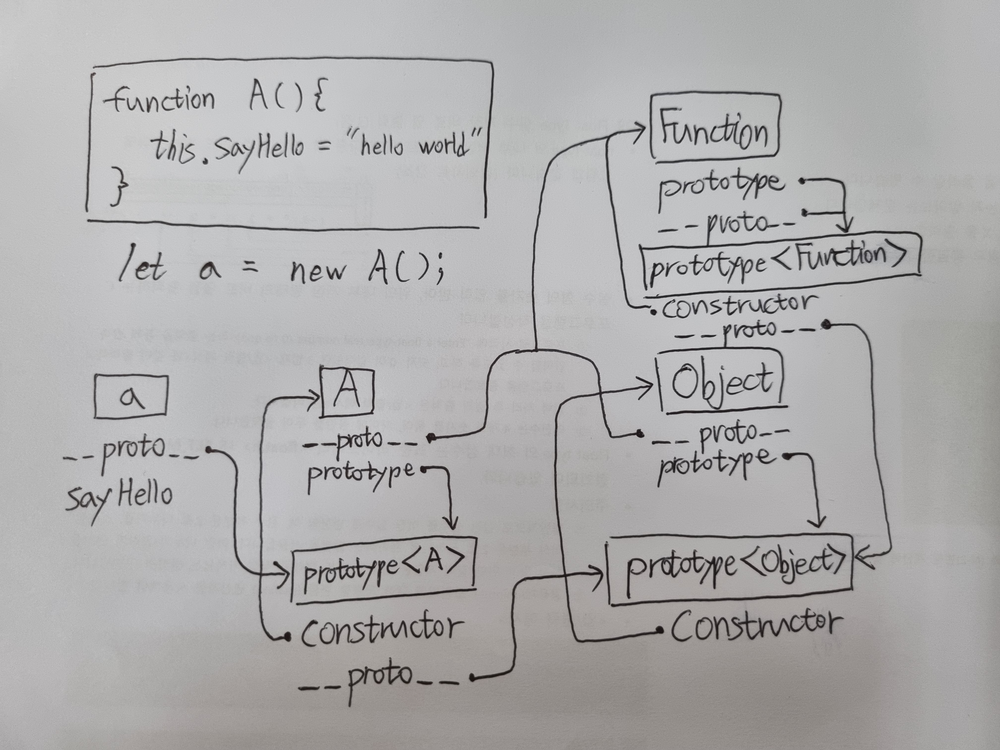

# 01,02,03,04 생략

<br><br><br><hr>

# 05. 표현식과 문

## - 문

프로그램을 구성하는 기본단위이자 최소 실행 단위(명령문)

## - 표현식

값으로 평가될 수 있는 문(Statement)은 모두 표현식(Expression)이다.


<br><br><br><hr>

# 06,07,08 생략

<br><br><br><hr>

# 09. 타입 변환과 단축 평가

## - '+' 암묵적 타입변환

```js
+''         //0
+'0'        //0
+'1'        //1
+'string'   //NaN
  
+true       //1
+false      //0
  
+null       //0
+undefined  //0
+Symbol()   // "TypeError"

+{}                 //NaN
+[]                 //0
+[1,2]              //NaN
+(function(){})     //NaN
```

## - Falsy 암묵적 타입변환

 - false
 - undefined
 - null
 - 0, -0
 - NaN
 - ''

`isFalsy()`라는 함수로 Falsy면 true, Truthy면 false를 반환 받을 수 있음

## - `?.`(옵셔널 체이닝 연산자)

왼측 피연산자가 null이나 undefined면 undefined를 반환하고, 아니면 참조 진행

```js
let elem = null;

let value = elem?.value;
console.log(value) //undefined
```

## - `??`(null 병합 연산자)

ES11(ECMAScript2020)에서 도입된 null 병합 연산자

왼측 피연산자가 null이나 undefined인 경우 우측 피연산자의 반환값으로

```js
let foo = null ?? '문자열';
console.log(foo); //"문자열"
```

<br><br><br><hr>

# 10. 객체 리터럴

Before ES6
```js
const obj = {
    name : 'Rhie',
    sayHi : function() {
        console.log(`Hi! ${this.name}`);
    }
}

obj.sayHi();  // Hi! Rhie
```

After ES6
```js
const obj = {
    name : 'Rhie',
    
    //메서드 축약 표현
    sayHi(){
        console.log(`Hi! ${this.name}`);
    }
} 

obj.sayHi();  // Hi! Rhie
```


<br><br><br><hr>

# 11. 원시 값과 객체의 비교 & 12. 함수

## - Primitive Type(원시 값)은 immutable하다.

### * ex) 문자열은 immutable이다.

```js
let str = "string";
str[0] = "S";
console.log(str); // "string"
```

### * ex) 숫자값 전달시 메모리 재할당

```js
let score = 95;
let copy = score; //score의 주소값이 아니라 값이 전달되며 재할당

//score과 copy는 다른 주소값을 갖는다.
console.log(score) //95
console.log(copy) //95

score = 100;

//score의 값을 변경해도 copy에 영향이 없다.
console.log(score); //100
console.log(copy); //95
```

## - Reference Type

### * Shallow Copy & Deep Copy

### * 함수도 객체다

함수 객체가 다른 점은 일반 객체는 호출할 수 없는 반면에 함수는 호출할 수 있는 것이다.

## - 함수 

### * 함수 선언 방법

 - 함수 선언문

```js
function sum(n1, n2){
    return n1 + n2;
}
```

 - 함수 표현식

```js
let sum = function(n1, n2){
    return n1 + n2;
}
```
함수는 함수 자체가 값을 나타내거나 표현하는 것이 아니기 때문에 표현식이 아니다. 즉, 변수에 할당할 수 없는 것이다. 그러나 위와 같이 함수 선언문이 변수에 할당되는 것처럼 보인다.

 - Function 생성자 함수

```js
let sum = new Function('n1','n2','return n1 + n2');
```
클로저 생성 안함.

 - 화살표 함수(ES6)

```js
let sum = (n1, n2) => n1 + n2;
```
this 바인딩, prototype, arguments 객체가 없음.
#### 함수 선언문과 함수 표현식

```js
console.log(add(4,2)); //6

function add(x, y){
    return x + y;
}
```

```js
console.log(add(4,2)); //ReferenceError

let add = function(x, y){
    return x + y;
}
```
함수 호이스팅은 함수를 호출하기 전에 함수를 선언해야 한다는 규칙을 무시하므로 함수 표현식 사용을 권장한다고 한다.(더글라스 크락포드)

### * 매개변수 기본값

인수를 전달하지 않은 경우와 undefined를 전달한 경우에만 유효

null은 null로 들어감

```js
function add(a, b, c){
    a = a || 0;
    b = b || 0;
    c = c || 0;
    return a + b + c
}
```
```js
function add(a = 0, b = 0, c = 0){
    return a + b + c
}
```
### * 반환문 생략시

반환문을 생략하면 암묵적으로 undefined가 반환된다.

### * IIFE

```js
let result = (function(x, y){
    return x + y;
})(10, 20);

console.log(result); //30
```

### * 순수함수와 비순수함수

외부 상태에 의존하지도 않고 외부 상태를 변경하지도 않는 부수 효과가 없는 함수를 `순수함수` 그 반대로 작용하면 `비순수함수`

<br><br><br><hr>

# 13. 스코프

스코프는 변수 이름의 충돌을 방지하여 같은 이름의 변수를 사용할 수 있게한다.

```js
let x = 10;

function foo(){
    let x = 5;
}

foo();

console.log(x); //10
```

## - 스코프 체인

### * 동적 스코프와 정적 스코프

 - `동적 스코프`라고 함 : 함수를 어디서 호출했는지에 따라 함수의 상위 스코프를 결정한다.

 - `정적 스코프` 또는 `렉시컬 스코프`라고 함 : 함수를 어디서 정의했는지에 따라 상위 스코프를 결정한다.

자바 스크립트는 렉시컬 스코프를 따르므로 함수를 어디서 호출했는지가 아니라 함수를 어디서 정의했는지에 따라 상위 스코프를 결정한다. 함수가 호출된 위치는 상위 스코프 결정에 어떠한 영향도 주지 않는다.

<br><br><br><hr>

# 14 생략

<br><br><br><hr>

# 15. let, const 키워드와 블록레벨 스코프

## - TDZ

```js
console.log(foo); //undefined
var foo;
console.log(foo); //undefined

foo = 1;
console.log(foo); //1
```

위 코드의 생명주기는 다음과 같다.

선언 단계와 초기화 단계가 동시에 이루어졌다.

그다음 `foo = 1`을 통해 할당 단계가 이루어졌다.

```js
console.log(foo) //ReferenceError
let foo; // 초기화 단계
console.log(foo) //undefined
foo = 1;
console.log(foo) //1
```
선언 단계와 TDZ(일시적 사각지대)까지 ReferenceError 발생

그 다음 초기화 단계와 할당 단계가 이루어진다.

<br><br><br><hr>

# 16. 프로퍼티 어트리뷰트

## - 디스크립터 객체
```js
const person = {
    name : 'Lee',
    age : 30
}

console.log(Object.getOwnPropertyDescriptor(person, 'name'));
//{value: "Lee", writable: true, enumerable: true, configurable: true}
console.log(Object.getOwnPropertyDescriptors(person));
/* 
{value: "Lee", writable: true, enumerable: true, configurable: true},
{value: 30, writable: true, enumerable: true, configurable: true}
*/
```

## - 데이터 어트리뷰트

 - value

접근하면 반환하는 값

 - writable

value 변경 가능 여부 

 - enumerable

열거 가능 여부, 불가능일 시 `Object.keys()`, `for문` 등으로 열거 불가

 - configurable

false일 시 프로퍼티 삭제 및 프로퍼티 어트리뷰트(프로퍼티 상태) 값의 변경이 금지된다. 단, writable이 true면 value의 변경과 writable을 false로 변경하는 건 허용한다.

## - 접근자 프로퍼티

 - get
 - set
 - enumerable : 데이터 프로퍼티와 같다.
 - configurable : 데이터 프로퍼티와 같다.

```js
const person = {
    name : "Rhie",
    age : 28,

    get info(){
        return `${this.name} : ${this.age}`
    },

    set info(infoObj){
        this.name = infoObj.name??this.name;
        this.age = infoObj.age??this.age;
    }
}

console.log(person.info); // Rhie : 28
person.info={
    name : "Eddie"
}
console.log(person.info); // Eddie : 28
```

### * 데이터 프로퍼티와 접근자 프로퍼티 구분

```js
Object.getOwnPropertyDescriptor(Object.prototype, '__proto__');
// 일반 객체의 __proto__는 접근자 프로퍼티

Object.getOwnProptertyDescriptor(function(){}, 'prototype'); 
// 함수 객체의 prototype은 데이터 프로퍼티
```

## - 정의

```js
Object.defineProperty(person, 'name', {
    value: 'rhie',
    writable: true,
    enumerable: true,
    configurable: true
})
```

## - immutable 객체

|구분|메서드|추가|삭제|읽기|쓰기|어트리뷰트 재정의|
|:---:|:---:|:---:|:---:|:---:|:---:|:---:|
|확장 금지|`Object.preventExtensions`|X|O|O|O|O|
|밀봉|`Object.seal`|X|X|O|O|X|
|동결|`Object.freeze`|X|X|O|X|X|

### * 확인

 - `Object.isExtensible()`
 - `Object.isSealed()`
 - `Object.isFrozen()`

<br><br><br><hr>

# 17. 생성자 함수에 의한 객체 생성

## - 내부 메서드 `[[Call]]`, `Constructor`

```js
function foo(){}

foo(); //[[Call]] 호출

new foo(); //[[Constructor]] 호출
```

## - 일반 함수 객체 반환

```js
function createUser(name, role){
    return {name , role}
}

let inst = new createUser('rhie','admin');
console.log(inst);
```

## - `new.target` || `scope-safe constructor`

```js
function Person(name, age){
    //이 함수가 new 연산자와 호출 되지 않으면 undefined임
    if(!new.target){
        return new Person(name, age);
    }
}
```

```js
function Person(name, age){
    if(!(this instanceof Person)){
        return new Person(name, age);
    }
}
```

<br><br><br><hr>

# 18. 함수와 일급 객체

## - arguments

Function.arguments는 ES3부터 표준에서 폐지됨

함수 내부에서 지역 변수처럼 사용하는 arguments 객체 참조하기

```js
function multiply(x, y){
    //이터레이터
    const iterator = arguments[Symbol.iterator]();s

    console.log(iterator.next()); // {value: 1, done: false}
    console.log(iterator.next()); // {value: 2, done: false}
    console.log(iterator.next()); // {value: 3, done: false}
    console.log(iterator.next()); // {value: undefined, done: true}

    return x * y;
}

multiply(1, 2, 3);
```

```js
function sum(){
    const array = Array.prototype.slice.call(arguments);
    return array.reduce(function(previous, previous){
        return previous + previous;
    }, 0)
}

console.log(sum(1, 2))          //3
console.log(sum(1, 2, 3, 4, 5)) //15
```

## - 함수의 name

```js
let nameFunc = function foo(){};
console.log(nameFunc.name); //foo
```

<br><br><br><hr>

# 19. 프로토타입

## - `[[Prototype]]`

모든 객체는 `[[Prototype]]`이라는 내부 슬롯을 가짐

`__proto__`는 `[[Prototype]]` 내부 슬롯이 가리키는 프로토타입 객체에 접근하는 용도

```js
const obj = {a: 1};
console.log(obj.__proto__ === Object.prototype); //true
```

```js
// 함수 객체는 prototype 프로퍼티를 소유한다.
(function() {}).hasOwnProperty('prototype'); //true

// 일반 객체는 prototype 프로퍼티를 소유하지 않는다.
({}).hasOwnProperty('prototype'); //false
```

### * 프로토타입 존재 이유

```js
function Circle(radius){
    this.radius = radius;
    this.getArea = function(){
        return Math.PI * this.radius ** 2;
    }
}

const c1 = new Circle(1);
const c2 = new Circle(2);

console.log(c1.getArea === c2.getArea); //false
```
메모리 낭비 발생

```js
function Circle(radius){
    this.radius = radius;
}

Circle.prototype.getArea = function(){
    return Math.PI * this.radius ** 2;
}

const c1 = new Circle(1);
const c2 = new Circle(2);

console.log(c1.getArea === c2.getArea); //true
```


### * 프로토타입 정보 얻기

`__proto__`로 접근하는 것보다는 `Object.getPrototypeOf`를 사용하는 것이 좋다.

```js
const obj = {};
const parent = { x : 1 };

Object.getPrototypeOf(obj); //obj.__proto__
Object.setPrototypeOf(obj, parent);

console.log(obj.x);
```

## - non-constructor
 - 화살표 함수와 메서드 축약 표현은 non-constructor이다.

```js
const Person = name => {
    this.name = name;
}

console.log(Person.hasOwnProperty('prototype')); // false
console.log(Person.prototype) // undefined

const obj = {
    foo(){}
}

console.log(obj.foo.hasOwnProperty('prototype')) //false
console.log(obj.foo.prototype) // undefined
```

## - 프로토타입 체인



## - Object.create()

### * 객체 생성

```js
//프로토타입이 object의 프로토타입인 객체를 생성한다.
let obj = Object.create(Object.prototype);
console.log(Object.getPrototypeOf(obj) === Object.prototype); //true

function Person(name){
    this.name = name;
}

// let me = new Person("rhie");
let me = Object.create(Person.prototype);
me.name = "rhie";
console.log(me.name) //rhie
console.log(me.getPrototypeOf(me) === Person.prototype) // true
```

## - 객체 상속

```js
const myProto = { x : 10 };

const obj = {
    y : 20,
    __proto__ : myProto
}

/* 
const obj = Object.create(myProto, {
    y : {value : 20, writable: true, enumerable : true, configurable: true}
})
*/
console.log(obj.x, obj.y); //10 20
```

## - static

```js
function Person(name){
    this.name = name;
}

//프로토타입 메서드
Person.prototype.sayHello = function(){
    console.log(`Hello~ my name is ${this.name}`);
}

Person.staticProperty = 'static 프로퍼티'
Person.staticMethod = function() {
    console.log('static 메서드');
}

const me = new Person('RHIE');

Person.staticMethod(); //static 메서드
me.staticMethod(); //TypeError 
```

## - 프로퍼티 확인

### * in

```js
const person = {
    name : "rhie",
    age : 10
}

console.log('name' in person); //true
console.log('gender' in person); //false
console.log('toString' in person); //true
```

여기서 `toString`이 true로 나온 이유는 in 연산자가 프로토타입 체인을 모두 훑기 때문이다.

### * Reflect.has

```js
const person = {name : 'rhie'};

console.log(Reflect.has(person, 'name')); //true
console.log(Reflect.has(person, 'toString')); //true
```

### * `Object.prototype.hasOwnProperty`

```js
const person = {name : 'rhie'};

console.log(person.hasOwnProperty('name')); //true
console.log(person.hasOwnProperty('toString')); //false
```

객체 고유의 프로퍼티 키인 경우에만 true를 반환하기 때문에 프로토타입이 상속받은 키인 경우에는 false를 반환한다.

## - 프로퍼티 열거

### * for...in문

```js
const sym = Symbol();
const person = {
    name : 'rhie',
    age : 10,
    __proto__ : { address : "seoul"}
    [sym] : 20
}

for (const key in person){
    console.log(`${key} : ${person[key]}`)
}
// name : rhie
// age : 10
// address : seoul
```

in 연산과 같이 상속받은 프로토타입의 프로퍼티까지 열거하지만 `Object.prototype`의 프로퍼티들이 열거되지 않은 이유는 이들의 `[[Enumerable]]`의 값이 false이기 때문이다.

또한, Symbol인 프로퍼티는 열거하지 않는다.

배열은 `for ...of`문이나 `Array.prototype.forEach`를 사용하는 것을 권장한다.

배열도 객체이므로 프로퍼티와 상속받은 프로퍼티가 포함될 수도 있기 때문에 요소가 아닌 프로퍼티를 제외할 필요성이 있기 때문이다.

```js
const arr = [1, 2, 3];
arr.x = 10;

for(const i in arr){
    console.log(arr[i]) // 1 2 3 10
}

console.log(arr.length) // 3

for (const value of arr){ //키가 아닌 값을 할당한다.
    console.log(value); //1 2 3
}
```

### * `Object.keys`, `Object.values`, `Object.entries`

```js
const person = {
    name : 'rhie',
    age : 10,
    __proto__ : { address : "seoul"}
}

console.log(Object.keys(person)) //["name", "age"]
console.log(Object.values(person)) //['rhie', 10]
console.log(Object.entries(person)); // [["name", "rhie"], ["age",10]]
```

<br><br><br><hr>

# 20. strict mode

```js
'use strict'
```

IIFE에 활용하는 것이 바람직하다.

```js
(function(){
    'use strict'

    x = 1 //ReferenceError
}())
```

## - 발생시키는 에러

 - 암묵적인 전역 사용시 ReferenceError
 - `delete`연산자를 통한 변수, 함수, 매개변수 삭제시 SyntaxError 발생
 - 매개변수의 이름 중복시 SyntaxError 발생

```js
(function(){
    'use strict';
    // SyntaxError
    function foo(x, x){
        return x + x;
    }
    console.log(foo(1, 2));
}())
```
 - with문 사용시 SyntaxError 발생
```js
//with문은 전달된 객체를 스코프체인에 추가한다.
//편리하지만 가독성이 나빠진다.
(function(){
    'use strict';

    with({x: 1}){ //SyntaxError
        console.log(x); 
    }
}())
```

## - 모드 적용에 의한 변화

 - 함수를 일반함수로서 호출하면 `this`가 window가 아닌 undefined로 바인딩된다.
 - 전달된 매개변수를 변경해도 arguments 객체에 반영안된다.

<br><br><br><hr>

# 21. 빌트인 객체

## - 전역 객체
```js
//브라우저
globalThis === this //this
globalThis === window //this
globalThis === self //this
globalThis === frames //this
 
//node.js 12.0 ~  //this
globalThis === this //this
globalThis === global  //this
```

https://developer.mozilla.org/ko/docs/Web/JavaScript/Reference/Global_Objects

Mah, Reflect, JSON을 제외한 표준 빌트인 객체는 모두 인스턴스를 생성할 수 있는 생성자 함수 객체이다.

## - Wrapper 객체

이미 Primitive Type이 있는데도 String, Number, Boolean 생성자 함수가 존재하는 이유는...

```js
const str = "hello";
console.log(str.length); //5
```

Primitive 값에 객체처럼 접근하면 임시로 해당 객체에 생성되어 프로토타입을 사용할 수 있다. 예를 들면 마침표(.) 표기법의 사용이다. 기존 값의 문자열은 래퍼 객체의 `[[StringData]]` 내부 슬롯에 할당된다. 처리가 종료되면 해당 슬롯의 값을 다시 되돌리고 GC의 대상이 된다.

## - 빌트인 함수

- eval

eval 함수를 통해 사용자로부터 입력받은 untrusted data를 실행하는 것은 보안에 취약하다. 또한 실행되는 코드는 자바스크립트 엔진에 의해 최적화가 수행되지 않으므로 일반적인 코드실행에 비해 처리 속도가 느리다. 그러므로 eval은 사용하지 말자

 - isFinite
 - isNaN
 - parseFloat
 - parseInt
 - encodeURI / decodeURI
 - encodeURIComponent / decodeURIComponent


<br><br><br><hr>

# 22. this

this에 바인딩될 객체는 호출 시점에 결정된다.

## * 함수 호출 방식과 this가 가리키는 것

 - 일반 함수 호출 : `전역 객체`
 - 메서드 호출 : `메서드를 호출한 객체`
 - 생성자 함수 호출 : `생성자 함수가 미래에 생성할 인스턴스`
 - Function.prototype.apply/call/bind 메서드에 의한 간접 호출 : `첫번째 인수로 전달한 객체`

```js
const foo = function(){
    console.log(this);
}
/////////////////////
foo(); //window
/////////////////////
const obj = {foo};
obj.foo(); // obj
/////////////////////
new foo(); //foo {}
/////////////////////
const bar = {name : 'rhie'};

foo.call(bar); //{name: "rhie"}
foo.apply(bar);//{name: "rhie"}
foo.bind(bar)();//{name: "rhie"}
```


<br><br><br><hr>

# 23. 실행 컨텍스트

## - 소스코드 타입과 실행 컨텍스트

 - 전역 코드 ==> 전역 실행 컨텍스트
 - 함수 코드 ==> 함수 실행 컨텍스트
 - eval 코드 ==> eval 실행 컨텍스트
 - 모듈 코드 ==> 모듈 실행 컨텍스트

## - How To

1. 전역 코드를 평가. 이 때 선언문만 먼저 실행 하고 전역 스코프에 등록
2. 코드 평가가 끝나면 런타임 시작. 전역 코드가 순차적으로 실행. 함수 호출을 만나면 전역 실행을 일시 중단하고 함수 내부로 진입
3. 함수 코드 실행 전 평가 진행. 매개변수, 지역변수 선언문 실행 후 그 결과를 지역 스코프에 등록. arguments 객체 생성 및 this 바인딩 결정
4. 런타임 실행으로 함수 코드가 순차적으로 실행. 메서드를 만나면 상위 스코프인 전역 스코프와 연결하여 검색. 전역 스코프를 통해 스코프 체인 검색. 프로토타입 체인을 통해 검색.

위와 같이 관리하는 것을 실행 컨텍스트라고 함. 소스코드를 실행하는데 필요한 환경을 제공하고 실행 결과를 관리하는 영역.

 - 코드 실행 순서는 실행 컨텍스트 스택으로 관리
 - 식별자와 스코프는 실행 컨텍스트의 렉시컬 환경으로 관리

### * 실행 컨텍스트 스택

```js
const x = 1;
function foo(){
    const y = 2;

    function bar(){
        const z = 3;
        console.log(x + y + z);
    }
    bar();
}

foo(); //6
```

Stack (step 1/7)

` `

Stack (step 2/7)

`전역 실행 컨텍스트`

Stack (step 3/7)

`전역 실행 컨텍스트` > `foo 함수 실행 컨텍스트`

Stack (step 4/7)

`전역 실행 컨텍스트` > `foo 함수 실행 컨텍스트` > `bar 함수 실행 컨텍스트`

Stack (step 5/7)

`전역 실행 컨텍스트` > `foo 함수 실행 컨텍스트`

Stack (step 6/7)

`전역 실행 컨텍스트`

Stack (step 7/7)

` `

### * 렉시컬 환경

교재 p368 ~ 387 참고


<br><br><br><hr>

# 24. 클로저

클로저는 상태(state)를 안전하게 변경하고 유지하기 위해 사용한다. 특정 함수에게만 상태 변경을 허용하기 때문이다.

## * private 하게 관리하기

자바스크립트는 public, protected, private과 같은 접근제한자를 제공하지 않고 기본적으로 모두 public하다.

```js
function Person(name, age){
    this.name = name; //public
    let _age = age; //private

    this.sayHi = function(){
        console.log(`Hi, I'm ${this.name}, ${_age}`);
    }
}

const me = new Person('rhie', 20);
me.sayHi(); //Hi, I'm rhie, 20
console.log(me.name) //rhie
console.log(me._age) //undefined

const you = new Person('eddie', 30);
you.sayHi(); //Hi, I'm eddie, 30
console.log(you.name) //eddie
console.log(you._age) //undefined
```

위 코드의 문제는 sayHi 메서드가 인스턴스 수대로 계속 생성되는 것이다. 프로토타입으로 설정하여 중복 생성을 방지해보자.

```js
function Person(name, age){
    this.name = name; //public
    let _age = age; //private
}

Person.prototype.sayHi = function(){
    console.log(`Hi, I'm ${this.name}, ${_age}`);
} //Uncaught ReferenceError: _age is not defined

const me = new Person('rhie', 20);
me.sayHi(); //Hi, I'm rhie, 20
console.log(me.name) //rhie
console.log(me._age) //undefined

const you = new Person('eddie', 30);
you.sayHi(); //Hi, I'm eddie, 30
console.log(you.name) //eddie
console.log(you._age) //undefined
```

이런... `_age`는 Person 함수의 지역변수라서 참조를 할 수가 없다. (런타임 때 이미 소멸)

클로저를 활용해보자

```js
const Person = (function(){
    let _age = 0; //private
    function Person(name, age){
        this.name = name; //public
        _age = age;
    }

    Person.prototype.sayHi = function(){
        console.log(`Hi, I'm ${this.name}, ${_age}`);
    }
    
    return Person;
}())


const me = new Person('rhie', 20);
me.sayHi(); //Hi, I'm rhie, 20
console.log(me.name) //rhie
console.log(me._age) //undefined

const you = new Person('eddie', 30);
you.sayHi(); //Hi, I'm eddie, 30
console.log(you.name) //eddie
console.log(you._age) //undefined

me.sayHi(); //Hi, I'm rhie, 30
```

그러나 이것 또한 문제가 존재한다. 바로 `_age` 변수가 공유되는 점이다. 왜냐하면 `sayHi()` 메서드가 단 한번 생성되는 클로저이기 때문이다. 이처럼 자바스크립트는 클로저 및 Symbol 혹은 WeakMap을 통해 private을 흉내낼 수는 있지만 이건 완전하지 않다.

but 표준으로 제안되어 있다.

[`https://github.com/tc39/proposal-class-fields#private-fields`](https://github.com/tc39/proposal-class-fields#private-fields)

```md
To make fields private, just give them a name starting with #.
```


<br><br><br><hr>

# 25. 클래스

자바스크립트의 문법적 설탕(Syntactic sugar) OR 새로운 객체 생성 메커니즘

`문법적 설탕`이란

- 사람이 이해 하고 표현하기 쉽게 디자인된 프로그래밍 언어 문법

- 사람이 프로그래밍 언어를 sweeter하게 사용 할 수 있도록 도와주는 문법

- 더욱 더 간결하고 명확하게 표현이 가능한 문법을 뜻 한다.

## - 기존 프로토타입 기반의 생성자 함수와 다른점

1. new 연산자 없으면 에러
2. 상속과 관련된 extends와 super가 존재
3. 호이스팅 발생하지 않은 것처럼 동작
4. 암묵적 strict mode
5. 클래스의 생성자, 메서드의 `[[Enumerable]]`의 값이 false. 열거 안됨.

## - 사용법

```js
//클래스 선언문
class Person{}

//익명 클래스 표현식
const Person = class {};

//기명 클래스 표현식
const Person = class MyClass {};
```

클래스는 함수다.

클래스는 let, const 키워드처럼 호이스팅된다.

```js
class Person{

    constructor(name){
        this.name = name;
    }
    //프로토타입 메서드
    sayHi(){
        console.log(`hi~ ${this.name}`)
    }

    static sayHello(){
        console.log("hello world");
    }
}

const me = new Person('rhie');

console.log(me.name); //rhie

me.sayHi(); //hi~ rhie

Person.sayHello(); //hello world

console.log(typeof Person) //function
```

## - constructor

constructor가 생략되면 `constructor() {}`가 정의된다.

```js
class Person{

    constructor(name){
        this.name = name;

        //명시적으로 객체를 반환하면 this 반환이 무시된다.
        //단, 원시 값을 반환하면 원시값은 무시되고 this가 반환된다.
        return {};
    }

}

const me = new Person('rhie');
console.log(me); // {}
```

this는 constructor와 메서드 내에서만 유효하다.

```js
class Person{

    constructor(name){
        this.name = name;
    }

    //프로토타입 메서드가 아니라 인스턴스 메서드가 된다.
    getName = function(){
        return this.name
    }
}
```

## - 상속

클래스를 흉내낸 의사 클래스 상속(pseudo classical inheritance) 패턴은 클래스 등장으로 더이상 필요하지 않다.

```js
class Animal{
    constructor(age, weight){
        this.age = age;
        this.weight = weight;
    }

    eat() {return 'eat';}

    move(){return 'move';}
}

class Bird extends Animal{
    fly() {return 'fly';}
}
```

의사 클래스 상속 적용시

```js
let Animal = (function(){
    function Animal(age, weight){
        this.age = age;
        this.weight = weight;
    }

    Animal.prototype.eat = function(){
        return 'eat';
    }

    Animal.prototype.move = function(){
        return 'move';
    }

    return Animal;
}());

let Bird = (function(){
    function Bird(){
        Animal.apply(this, arguments);
    }

    Bird.prototype = Object.create(Animal.prototype);

    Bird.prototype.constructor = Bird;

    Bird.prototype.fly = function(){
        return 'fly';
    }
    return Bird;
}());
```

서브클래스에서 contructor를 생략하면 다음과 같이 암묵적으로 정의된다.

```js
constructor(...args) {super(...args);}
```

`...` : REST 파라미터


### * super

`super`는 super-constructor를 호출한다.

서브클래스는 자신이 인스턴스를 생성하지 않고 수퍼클래스에게 인스턴스 생성을 위임한다.

그러므로 `super`가 필요하다.

`super`의 호출 종료 후 제어 흐름이 서브 클래스의 constructor에 돌아올 때 `super`가 반환한 인스턴스가 this에 바인딩된다. 이러한 이유로 `super`가 맨 위에 있어야 한다.

```js
class Animal{
    constructor(){
        console.log(this); //Bird {}
        console.log(new.target); //class Bird extends Animal{}
    }
}

class Bird extends Animal{}

new Bird();
```


```js
class Animal{
    constructor(name){
        this.name = name;
    }

    move(){return `${this.name} is moving`;}
}

class Bird extends Animal{
    move(){
        return `${super.move()}. wonderful!`;
    }
}
```
위아래는 같은 코드다.
```js
class Animal{
    constructor(name){
        this.name = name;
    }

    move(){return `${this.name} is moving`;}
}

class Bird extends Animal{
    move(){
        const __super = Object.getPrototypeOf(Animal.prototype);
        return `${__super.move().call(this)}. wonderful!`;
    }
}
```

### * `[[HomeObject]]`

위 내부 슬롯을 가진 함수만이 super 참조를 할 수 있다. 

이는 자신을 바인딩하고 있는 객체를 가리킨다.

super 참조는 내부 슬롯 `[[HomeObject]]`를 사용하여 수퍼클래스의 메서드를 참조한다.

```js
super = Object.getPrototypeOf([[HomeObject]])
```

```js
const obj = {
    //축약 표현 메서드는 갖는다.
    foo() {},
    
    //일반 함수는 갖지 않는다.
    bar: function() {}
}
```


<br><br><br><hr>

# 26. ES6 함수

|ES6 함수 구분|constructor|prototype|super|arguments|
|:---:|:---:|:---:|:---:|:---:|
|일반함수(normal)|O|O|X|O|
|메서드(method)|X|X|O|O|
|화살표함수(arrow)|X|X|X|X|

메서드는 축약표현으로 정의된 함수만을 의미힌다.

## * 화살표 함수

아래 두 함수는 같다.
```js
const power = x => x *** 2;
const power = x => {return x ** 2}
```

객체 리터럴 반환은 아래와 같다.

```js
const create = (id, content) => ({id, content});
create(1, 'js') //{id: 1, content: "js"}
```

```js
const create = (id, content) => {id, content};
create(1, 'js') //undefined
```

화살표 함수도 IIFE가 가능하다.

화살표 함수의 this는 상위 스코프를 가리킨다. (동적으로 결정)

아래 두 함수는 같다.

```js
() => this.x;
(function() {return this.x;}).bind(this);
```


<br><br><br><hr>

# 27. 배열

## - JS 배열의 특징

JS에서는 배열이라는 타입이 따로 존재하지 않는다. 배열은 객체다.

```js
arr = ['apple', 'banana', 'orange']
typeof arr //object
arr.constructor === Array //true
Object.getPrototypeOf(arr) === Array.prototype //true
```

보통 배열은 동일한 크기의 메모리 공간이 연속적으로 이어져 있는 밀집 배열(dense array)이지만 자바스크립트의 배열은 각각의 메모리 공간이 동일한 크기를 갖지 않아도 되고 연속적으로 이어져 있지 않을 수도 있어 희소 배열(sparse array)이다.

즉, JS의 배열은 배열을 흉내낸 특수  객체다. 자바스크립트 배열의 요소는 사실 프로퍼티 값이다. 인덱스로 배열에 접근하면 느리지만 삽입 또는 삭제할 때는 빠르다. 

## - empty

```js
const arr = [1];
arr.length = 3;
console.log(arr.length) //3
console.log(arr) //[1, empty, empty]
console.log(Object.getOwnPropertyDescriptors(arr));
/* 
0: {value: 1, writable: true, enumerable: true, configurable: true}
length: {value: 3, writable: true, enumerable: false, configurable: false}
[[Prototype]]: Object
*/
```
여기서 empty는 실제로 추가된 배열이 아니다. 메모리 공간을 확보하지도 않고 빈 요소를 생성하지도 않는다.

이처럼 배열의 요소가 연속적으로 위치하지 않고 일부가 비어있는 배열을 희소배열이라고 한다.
```js
const sparse = [ ,2, ,4];
console.log(sparse.length); //4
console.log(sparse); //[empty, 2, empty, 4]
console.log(Object.getOwnPropertyDescriptors(sparse));
/*  
1: {value: 2, writable: true, enumerable: true, configurable: true}
3: {value: 4, writable: true, enumerable: true, configurable: true}
length: {value: 4, writable: true, enumerable: false, configurable: false}
*/
```

## - 배열 생성

```js
const arr = [1, 2, 3] //배열 리터럴
const arr2_1 = new Array(10); //생성자 함수 : empty * 10
const arr2_2 = new Array(1, 2, 3); //생성자 함수 : [1, 2, 3]
const arr3 = Array.of(1, 2, 3) // ES6에 생겨난 배열 생성
const arr4_1 = Array.from({length : 2, 0: 'a', 1: 'b'}) //['a','b']
const arr4_2 = Array.from('Hello') //['H','e','l','l','o']
const arr4_3 = Array.from({length: 3}) //{undefined, undefined, undefined}
// Generate a sequence of numbers
// Since the array is initialized with `undefined` on each position,
// the value of `v` below will be `undefined`
Array.from({length: 5}, (v, i) => i); //[0, 1, 2, 3, 4]
```

## - 배열 메서드

### * Array.prototype.includes()

### * Array.prototype.fill()

### * Array.prototype.flat()

### * Array.prototype.find()

### * Array.prototype.findIndex()


<br><br><br><hr>

# 28. Number

## - 프로퍼티

### * Number.EPSILON

### * Number.MAX_VALUE

### * Number.MIN_VALUE

### * Number.MAX_SAFE_VALUE

### * Number.MIN_SAFE_VALUE

### * Number.POSITIVE_INFINITY

### * Number.NEGATIVE_INFINITY

### * Number.NaN

## - 메서드

### * Number.isFinite()

### * Number.isInteger()

### * Number.isNaN()

### * Number.isSafeInteger()

### * Number.prototype.toExponential()

### * Number.prototype.toFix()

### * Number.prototype.toPrecision()

### * Number.prototype.toString()

<br><br><br><hr>

# 29. Math

## - 프로퍼티

### * Math.PI

## - 메서드

### * Math.abs()

### * Math.round()

### * Math.ceil()

### * Math.floor()

### * Math.sqrt()

### * Math.random()

### * Math.pow()

### * Math.max()

### * Math.min()

<br><br><br><hr>

# 30. Date