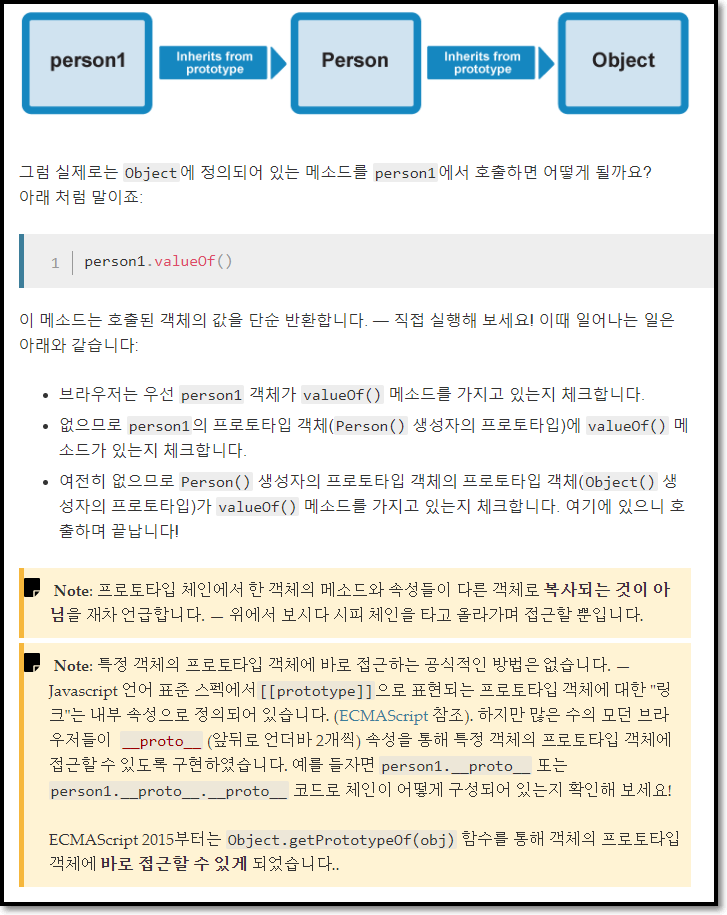

# Javascript 기초


## Javascript란?

JavaScript(JS)는 가벼운 인터프리터 또는 **JIT컴파일** 언어

 - JIT 컴파일

JIT 컴파일(just-in-time compilation) 또는 동적 번역(dynamic translation)은 프로그램을 실제 실행하는 시점에 기계어로 번역하는 컴파일 기법

전통적인 입장에서 컴퓨터 프로그램을 만드는 방법

1. 인터프리트 방식은 실행 중 프로그래밍 언어를 읽어가면서 해당 기능에 대응하는 기계어 코드를 실행

2. 정적 컴파일은 실행하기 전에 프로그램 코드를 기계어로 번역한다.

JIT 컴파일러는 두 가지의 방식을 혼합한 방식

실행 시점에서 인터프리트 방식으로 기계어 코드를 생성하면서 그 코드를 캐싱하여, 같은 함수가 여러 번 불릴 때 매번 기계어 코드를 생성하는 것을 방지한다.

최근의 자바 가상 머신과 .NET, V8(node.js)에서는 JIT 컴파일을 지원한다. 즉, 자바 컴파일러가 자바 프로그램 코드를 바이트코드로 변환한 다음, 실제 바이트코드를 실행하는 시점에서 자바 가상 머신이 바이트코드를 JIT 컴파일을 통해 기계어로 변환한다.

바이트코드 컴파일러는 소스 코드를 중간언어인 바이트코드로 변환한다. 바이트코드는 기계어는 아니지만 가상 머신에 의해 기계어로 손쉽게 변환할 수 있는 코드이다. JIT 컴파일러는 바이트코드를 읽어 빠른 속도로 기계어를 생성할 수 있다. 이런 기계어 변환은 코드가 실행되기 과정에 실시간으로 일어나며(그래서 Just-In-Time이다), 전체 코드의 필요한 부분만 변환한다. 기계어로 변환된 코드는 캐시에 저장되기 때문에 재사용시 컴파일을 다시 할 필요가 없다.

일반적인 인터프러터 언어(예시: cpython)는 바이트코드나 소스코드를 최적화 과정이 없기 번역하기 때문에 성능이 낮다. 반면 정적으로 컴파일하는 언어(예시: c 언어)는 실행 전에 무조건 컴파일을 해야하기 때문에 다양한 플랫폼에 맞게 컴파일을 하려면 시간이 오래 걸린다. 동적 컴파일 환경은 실행 과정에서 컴파일을 할 수 있기 위해 만들어졌다. JIT는 정적 컴파일러 만큼 빠르면서 인터프러터 언어의 빠른 응답속도를 추구하기 위해 사용한다. 바이트코드 컴파일러가 시간이 많이 소요되는 최적화를 미리 해주기 때문에 바이트코드에서 기계어 번역은 훨씬 빠르게 진행될 수 있다. 또한 바이트코드는 이식성이 뛰어나 가상 머신이 설치되어 있으면 빠르게 실행할 수 있다.

## Javascript 시작하기


### 자바스크립트 파일 불러오기

 - make `main.js` file first

```javascript
const myHeading = document.querySelector('h1');
myHeading.textContent = 'Hello world!';
```

```html
<script src="scripts/main.js"></script>
```

### 자료형 종류

| Variable | Example |
|:---:|:---|
|String|let myVariable = 'Bob';|
|Number|let myVariable = 10;|
|Boolean|let myVariable = true;|
|Array|let myVariable = [1, 'Bob', 10, 'Steve'];|
|Object|let myVariable = document.querySelector('h1');|

### 주석
```javascript
/*
    Everything in between is a comment
*/
```
```javascript
// This is a comment
```

### 연산자

다른 언어의 연산자와 비슷하지만 특별히 봐야할 연산자는 다음과 같습니다.
<br>

|연산자|설명|
|:---:|:---|
|`==/!=`| 값만 비교 |
|`===/!==`| 값 뿐만 아니라 자료형도 비교 |

### [중요] 변수 선언 : var, let, const

 - hoisting : 모든 변수 선언은 호이스트 된다.

    - 변수가 함수 내에 정의됨[function scope] ->선언이 함수의 최상위

    - 변수가 함수 밖에 정의됨[global scope] -> 전역 컨텍스트의 최상위

#### var

먼저 `var` 선언부터 살펴보자
```javascript
//var i           <-- i가 이곳으로 Hoisting됨
for (var i = 0; i < 10; i++) {
    console.log('i', i)
}
console.log('출력되나요? ', i) //출력이 된다.
```
for문이 끝나도 for문 안에 쓰인 변수 호출이 가능하다는 것을 볼 수 있다.

그렇다면 함수 내에 선언되는 `var` 선언은 어떻게 될까?

```javascript
function func() {
    // var j           <-- j가 이곳으로 Hoisting됨
    for(var j=0; j<10; j++) {
      console.log('j', j)
    }
}
func();
console.log('출력되나요?', j) // Error
```
이번에는 함수 밖에 호출이 불가하다

`immediately-invoked function expression (or IIFE, pronounced "iffy")`

IIFE인 경우엔 변수 스코프가 어떻게 될까?
```javascript
(function() {
    //var k
    for(var k=0; k<10; k++) {
      console.log('k', k)
    }
})();
console.log('출력되나요?', k) // Error
```
이 역시 함수 밖에는 호출이 불가하다.

그런데 IIFE라고 해도 만일 `var` 선언을 깜박하면 어떻게 될까?

```javascript
//var t;
(function() {
    for(t=0; t<10; t++) {
        console.log('t', t)
    }
})();
console.log('출력되나요?', t)
//IIFE를 써도 또 이런식으로 hoisting되는...
```
놀랍게도 global scope로 적용되는 것을 볼 수 있다. 변수를 선언할 때는 최소한 `var`이라도 선언 해 에러를 예방하자.

혹은 `use strict`를 사용하자
```javascript
(function() {
    'use strict'
    for(v=0; v<10; v++) {
        console.log('v', v)
    }
})()
```
출력 결과 화면
```
   for(v=0; v<10; v++) {
         ^

ReferenceError: v is not defined
    at c:\Users\quoti\Desktop\OnlyLocal\Code-Source\Playground.JS\legacy\01-var-let-const.js:53:10
    at Object.<anonymous> (c:\Users\quoti\Desktop\OnlyLocal\Code-Source\Playground.JS\legacy\01-var-let-const.js:56:3)
    at Module._compile (internal/modules/cjs/loader.js:1158:30)
    at Object.Module._extensions..js (internal/modules/cjs/loader.js:1178:10)
    at Module.load (internal/modules/cjs/loader.js:1002:32)
    at Function.Module._load (internal/modules/cjs/loader.js:901:14)
    at Function.executeUserEntryPoint [as runMain] (internal/modules/run_main.js:74:12)
    at internal/main/run_main_module.js:18:47
Process exited with code 1
```

#### let, const

var의 문제 : 변수 재선언
```js
var a = 10;
var a = 'hi';
a = 'hello'
console.log('var : ' + a);
```
 - 해결법 : 변수 재선언 불가하게 만들기
    - let : mutable
    - const : immutable
```js
let b = 10;
let b = 'hi'; //Error
b = 'hello'
console.log('let : ' + b)

const c = 10;
const c = 'hi'; //Error
c = 'hello' //Error
console.log('const : ' + c)
```

let과 const도 hoist가 발생한다. 하지만...
```js
d = 'tdz'
let d; //Error
```
 
`TDZ(Temporal Dead Zone)`
: JS 인터프리터 내부에서 변수는 총 3단계를 걸쳐 생성된다.

1. Declaration : 스코프와 변수 객체가 생성되고 스코프가 변수 객체를 참조한다.
  
1. Initialization : 변수 객체가 가질 값을 위해 메모리에 공간을 할당한다. 이때 초기화되는 값은 undefined이다.

1. Assignment : 변수 객체에 값을 할당한다.

Declaration만 일어나면 Initialization이 되지않아 변수에 담길 값을 위한 공간이 메모리에 할당되지 않은 상태
```js
let aaa;
aaa = 'later' 
```
let 은 변수를 먼저 선언하고 나중에 값을 할당하는 것이 가능하지만...
```js
const bbb //Error
```
const는 선언과 동시에 값을 할당해야만 한다.

#### 총정리 + 추가 정보
 
- var : 함수 레벨 스코프, function scope
- let, const : 블록 레벨 스코프, block scope

`var`

만일 변수를 처음 선언할 때 키워드(var, let, const...) 없이 선언하면 자동으로 var로 선언된다.
```js
var globalVar = 'the global variable'

if(globalVar === 'the global variable'){
    var globalVar = 'the local variable'
}

console.log(globalVar);
```
출력화면
```
the local variable
```
<br>

`let, const`
```js
let globalLet = 'the global variable'

if(globalLet === 'the global variable'){
    let globalLet = 'the local variable'
    let localLet = 'the local variable2'
}

console.log(globalLet);
console.log(localVar); //Error
```
출력화면
```
the global variable
```

### 함수

선언하는 방법
```js
function multiply(num1,num2) {
  let result = num1 * num2;
  return result;
}
```

사용하는 방법
```js
multiply(4, 7);
multiply(20, 20);
multiply(0.5, 3);
```

익명함수
```js
//대부분 이벤트 발생에 따른 수많은 코드를 작동하기 위해 주로 쓰인다.
myButton.onclick = function() {
  alert('hello');
  // I can put as much code
  // inside here as I want
}

//변수 속에 익명 함수를 넣을 수도 있다
var myGreeting = function() {
  alert('hello');
}
```

#### 함수와 스코프 문제

우리 '스코프(scope)'에 대해 얘기해 볼까요? '스코프'는 함수와 관련된 매우 중요한 개념입니다.  함수를 생성할 때, 변수 및 함수 내 정의된 코드들은 그들만의 '스코프' 안에 자리하게 됩니다. 그 말인 즉슨, 다른 함수의 내부나 외부 함수의 코드가 접근할 수 없는 그들만의 구획에 갇혀 있다는 뜻입니다. 

함수 바깥에 선언된 가장 상위 레벨의 스코프를 '전역 스코프(global scope)' 라고 부릅니다.전역 스코프 내에 정의된 값들은 어느 코드든 접근이 가능합니다.

자바스크립트는 다양한 이유로 인해 이와 같은 기능을 제공하지만, 주로는 안전성과 구조 때문입니다. 어떤 때에는 당신의 변수가 어느 코드나 접근 가능한 변수가 되는 걸 원치 않을 겁니다. 당신이 어딘가에서 불러온 외부 스크립트가 문제를 일으킬 수도 있으니깐요. 외부 스크립트의 코드와 같은 변수 이름을 사용하면 충돌이 일어나게 돼요. 이건 악의적일 수도 있고, 아님 뭐 단순한 우연이겠죠.

예를 들어 , 당신에게 두 개의 외부 자바스크립트 파일을 호출하는 HTML이 있다고 쳐요. 그 둘은 같은 이름으로 정의된 변수와 함수를 사용하고 있습니다.

```html
<!-- Excerpt from my HTML -->
<script src="first.js"></script>
<script src="second.js"></script>
<script>
  greeting();
</script>
```
```js
// first.js
var name = 'Chris';
function greeting() {
  alert('Hello ' + name + ': welcome to our company.');
}
```
```js
// second.js
var name = 'Zaptec';
function greeting() {
  alert('Our company is called ' + name + '.');
}
```
두 함수 모두 greeting()라고 불리지만,  당신은 second.js  파일의 greeting() 함수에만 접근 가능합니다. HTML 소스 코드 상 후자이므로, 그 파일의 변수와 기능이  first.js것을 덮어쓰는 거죠.

### 이벤트

이벤트를 헨들링하는 많은 방법이 있다.

`<html>` 요소를 선택하고 `onclick`이라는 핸들러(handler)를 추가한다.

그리고 익명 함수(anonymous function)을 추가해 `onclick` 이벤트 발생시 처리할 동작을 선언한다.

```js
document.querySelector('html').onclick = function() {
    alert('Ouch! Stop poking me!');
}
```
다음과 같이 할 수도 있다.
```js
let myHTML = document.querySelector('html');
myHTML.onclick = function() {};
```

### 조건문

조건문 문법 역시 다른 언어들과 똑같다.
```js
if(!localStorage.getItem('name')) {
  setUserName();
} else {
  let storedName = localStorage.getItem('name');
  myHeading.textContent = 'Mozilla is cool, ' + storedName;
}
```

null 처리하는 방법
```js
function setUserName() {
  let myName = prompt('Please enter your name.');
  if(!myName) {
    setUserName();
  } else {
    localStorage.setItem('name', myName);
    myHeading.innerHTML = 'Mozilla is cool, ' + myName;
  }
}
```

Switch문도 있네?
```js
switch (expression) {
  case choice1:
    run this code
    break;

  case choice2:
    run this code instead
    break;
    
  // include as many cases as you like

  default:
    actually, just run this code
}
```

삼항 연산자도 있음
```js
( condition ) ? run this code : run this code instead

var greeting = ( isBirthday ) ? 'Happy birthday Mrs. Smith — we hope you have a great day!' : 'Good morning Mrs. Smith.';
```

### HTML 속 JS 활용 팁

#### 함수 활용은 이렇게

```js
function createParagraph() {
  let para = document.createElement('p');
  para.textContent = 'You clicked the button!';
  document.body.appendChild(para);
}
//HTML 내의 <scirpt>태그 내부에 작성

<button onclick="createParagraph()">Click me!</button>
```

하지만, 이 방법은 효율적이지 않습니다. 이는 자바스크립트와 함께 HTML 소스를 복잡하게 할 수 있습니다. 또한 함수를 만들기 위한 모든 버튼 마다 onclick="createParagraph()" 속성을 포함해야합니다.

그러므로...
```js
const buttons = document.querySelectorAll('button');
//모든 <button>태그를 List 형태로 buttons 변수에 저장한다.

for (let i = 0; i < buttons.length ; i++) {
  buttons[i].addEventListener('click', createParagraph);
}
//복수이기 때문에 for를 사용해 루프를 돌린다.
```
 페이지가 많든, 버튼의 수가 많든 적든 상관없이 모든 버튼들이 같은 기능을 할 수 있도록 합니다.

#### 스크립트 로딩은 이렇게

작성된 스크립트를 브라우저가 적절한 때에 로딩하는것에 대해 몇가지 이슈가 있습니다. 중요한 것은 모든 HTML 요소는 순서대로 페이지에 로드된다는 것입니다. 만약 당신이 자바스크립트를 이용해 HTML 요소를 조작할 경우(정확하게는 DOM), 자바스크립트 코드가 조작 대상인 HTML 요소보다 먼저 실행된다면 조작할 요소가 존재하지 않는 상태이기 때문에 제대로 동작하지 않을 것입니다.

내부와 외부의 자바스크립트는 HTML Document의 body가 해석되기 전인 head 부분에 로드되고 실행되었습니다. 이는 에러를 일으킬 수 있습니다. 그래서 여기에 사용되는 몇가지 해결방법들이 있습니다.

 - 내부 JS

```js
document.addEventListener("DOMContentLoaded", function() {
  ...
});
```

이 이벤트리스너는 "DOMContentLoad" 이벤트가 발생되었을 때 function()을 실행한다는 의미입니다.

"DOMContentLoad" 이벤트는 브라우저가 완전히 로드되고 해석될때 발생됩니다. function(){} 내부의 자바스크립트 구문은 이벤트가 발생되기 전까지는 실행되지 않습니다. 따라서 모든 body태그의 요소가 로드된 이후 자바스크립트 코드가 실행되도록 만들어 에러를 피할 수 있습니다.

 - 외부 JS

```js
<script src="script.js" async></script>
```
일반적으로 HTML요소를 로딩하는 중 \<scirpt>태그를 만나면 JavaScript의 내용이 모두 다운될 때까지 HTML로딩은 멈추게 되는데, async요소는 비동기방식으로 \<script>태그에 도달했을 때 브라우저에게 HTML 요소를 멈추지 않고 다운받도록 유지시킵니다.

이 경우 script와 HTML은 모두 동시에 로드되고 작동할 것입니다.

예전 방식은 scirpt 요소를 body태그의 맨 끝에 넣는 방법이었습니다(</body> 바로 위에). 이 방식을 사용해도 body태그가 모두 로드된 이후 scirpt가 실행되게 만들 수 있습니다. 문제는 이 방법과 DOMContentLoaded를 이용한 방법 모두 HTML DOM이 로드되기 전까지 script의 로딩과 파싱이 완전히 차단된다는 것입다. 이는 많은 자바스크립트 코드를 다루는 규모가 큰 사이트의 경우 사이트를 느리게 만드는 중요한 성능 문제를 야기할 수 있습니다. 이것이 async 속성을 사용해야 하는 이유입니다!


async 스크립트는 페이지 렌더링의 중단 없이 스크립트를 다운로드 하고, 또한 스크립트의 다운로드가 끝나자 마자 이를 실행시킵니다. async는 외부 스크립트끼리의 구체적인 실행 순서는 보장하지 않고, 단지 나머지 페이지가 나타나는 동안 스크립트가 비동기방식으로 다운로드 되어 중단되지 않는다는 것만 보장합니다. async는 각각의 스크립트가 독립적으로, 서로에게 의존하지 않는 관계일 때 적절합니다.

```js
<script async src="js/vendor/jquery.js"></script>

<script async src="js/script2.js"></script>

<script async src="js/script3.js"></script>
```
3개의 스크립트를 로딩하지만 이들의 순서는 보장할 수 없습니다.

script3.js에 있는 함수가 jquery.js의 함수를 사용한다면 에러를 발생될 수 있다는 것을 의미합니다.

```js
<script defer src="js/vendor/jquery.js"></script>

<script defer src="js/script2.js"></script>

<script defer src="js/script3.js"></script>
```
Defer는 이와 다르게 순서대로 다운로드 한 후 모든 스크립트와 내용이 다운로드 되었을 때 실행됩니다:

따라서 위의 예제의 경우에는 jquery.js -> script2.js -> script3.js 의 순서가 보장됩니다.

### 문자열 다루기
 - 문자열 길이 활용

```js
var browserType = 'mozilla';
browserType[browserType.length-1];
```

 - 문자열 찾기 활용
```js
var browserType = 'mozilla';
browserType.indexOf('zilla'); // 2
browserType.indexOf('vanilla'); // -1
```
 
 - 문자열 자르기
```js
var browserType = 'mozilla';
browserType.slice(0,3); // "moz"
browserType.slice(2); // "zilla"
```

 - 대소문자 변경
```js
var radData = 'My NaMe Is MuD';
radData.toLowerCase(); // "my name is mud"
radData.toUpperCase(); // "MY NAME IS MUD"
```

 - 문자열 일부 변경
```js
browserType.replace('moz','van');
```
replace() 리턴값은 replace결과 문자열인데 만일 바뀜을 당하는 문자가 없다면 그냥 그대로 다시 리턴되고 만일 바뀜을 당하는 문자가 있다면, 바뀐 후의 문지열이 리턴된다.

### 배열
여타 프로그래밍 언어가 배열을 다루는 법과 같다.method만 다뤄보자.

 - split() : 문자열 분리
```js
var myData = 'Manchester,London,Liverpool,Birmingham,Leeds,Carlisle';
var myArray = myData.split(',');
myArray;
// (6) ["Manchester", "London", "Liverpool", "Birmingham", "Leeds", "Carlisle"]
```

 - join() : 문자열 합체
```js
var myNewString = myArray.join(',');
myNewString;
```
배열을 문자열로 변환하는 또 다른 방법은 **`toString()`** 를 사용하는 것 
```js
var dogNames = ['Rocket','Flash','Bella','Slugger'];
dogNames.toString(); //Rocket,Flash,Bella,Slugger
```
 - item 추가/제거

push() : 배열의 끝에 추가할 item을 반드시 하나 이상 포함해야 한다는 점을 기억
```js
myArray.push('Cardiff');
myArray;
myArray.push('Bradford', 'Brighton');
myArray;
```

pop() : 배열 끝 삭제
```js
var myArray = ["Manchester", "London", "Liverpool", "Birmingham", "Leeds", "Carlisle"]
myArray.pop()
//return "Carlisle"
myArray
// (5) ["Manchester", "London", "Liverpool", "Birmingham", "Leeds"]
```

*그러면 배열의 제일 처음 부분 item 추가/제거는?*

unshift() <-> push()
```js
myArray.unshift('Edinburgh');
myArray;
```
shift() <-> pop()
```js
myArray.shift();
```

### 자바스크립트 객체

 - 객체란 관련된 데이터와 함수의 집합

```JS
var person = {};
```
출력 결과
```
[Object Object]
```
 - 객체에 데이터와 함수 넣기
```js
var person = {
  name: ['Bob', 'Smith'],
  age: 32,
  gender: 'male',
  interests: ['music', 'skiing'],
  bio: function() {
    alert(this.name[0] + ' ' + this.name[1] + ' is ' + this.age + ' years old. He likes ' + this.interests[0] + ' and ' + this.interests[1] + '.');
  },
  greeting: function() {
    alert('Hi! I\'m ' + this.name[0] + '.');
  }
};
```
우리가 만든 person 객체는 문자열, 숫자, 배열 두개와 두개의 함수를 가지고 있다. 처음 4개의 아이템은 데이터 아이템인데, 이걸 객체의 속성(Property)라고 부른다. 끝에 두개의 아이템은 함수인데 이 함수를 통해 데이터를 가지고 뭔가 일을 할 수 있게 됩니다. 이걸 우리는 메소드(Method) 라고 부릅니다.

 - 객체 데이터 하위 namespace 접근
```js
var person = {
  name : {
  first: 'Bob',
  last: 'Smith'
  }
}

//--방식1
person.age
person.name.first

//--방식2
person['age']
person['name']['first']
```
위와 같은 방법으로 기존에 존재하는 속성이나 메소드의 값을 설정하는 것 뿐만아니라 완전히 새로운 멤버를 생성할 수도 있다.

#### this에 관하여
```js
var person = {
  greeting: function() {
  alert('Hi! I\'m ' + this.name.first + '.');
  }
}
```
this 키워드는 지금 동작하고 있는 코드를 가지고 있는 객체를 가리킵니다. 위의 예제에서 this 는 person 객체와 동일합니다.

```js
var person1 = {
  name: 'Chris',
  greeting: function() {
    alert('Hi! I\'m ' + this.name + '.');
  }
}

var person2 = {
  name: 'Brian',
  greeting: function() {
    alert('Hi! I\'m ' + this.name + '.');
  }
}
```
이 예제에서, 메소드의 실제 코드는 완전히 동일하지만 person1.greeting() 은 "Hi! I'm Chris." 를 출력합니다. 반면 person2.greeting() 은 "Hi! I'm Brian." 을 출력하게 됩니다. 앞서 이야기한 것처럼, this 은 실행중인 코드가 속해있는 객체입니다. 객체 리터럴을 직접 지정해서 사용하는 경우라면 그리 유용하지 않겠지만, 동적으로 객체를 생성하는 경우(예를 들면 생성자를 사용하는 경우)에는 매우 유용합니다. 

 - 객체 템플릿의 템플릿 정의(`추상화`:프로그래머의 의도에 맞추어 가장 중요한 것들만을 뽑아서 복잡한 것들을 보다 단순한 모델로 변환하는 작업) --`Instantiation`--> 실제 객체 생성

 -  OOP 에서는,특정 클래스를 기반으로 새로운 클래스를 만들 수 있습니다 — child 클래스 는 부모 클래스를 상속 받아서 만들어집니다. child 클래스는 상속을 통해 부모 클래스에 정의된 데이터와 함수를 고스란히 사용할 수 있습니다. 클래스마다 기능이 달라지는 부분이 있다면, 직접 해당 클래스에 원하는 기능을 정의할 수 있습니다.

 혹시 궁금해 하실까봐 말씀드리면, 여러 객체 타입에 같은 기능을 정의할 수 있는 능력을 멋진 용어로 "다형성(polymorphism)" 이라고 합니다.

#### 객체 생성에 관하여

사람을 정의해 보자
```js
function createNewPerson(name) {
  var obj = {};
  obj.name = name;
  obj.greeting = function() {
    alert('Hi! I\'m ' + this.name + '.');
  };
  return obj;
}
```
이제 함수를 호출해 새로운 사람을 만들자
```js
var salva = createNewPerson('Salva');
salva.name;
salva.greeting();
```
그런데... 꼭 빈 객체를 만들어서 내용을 채운 다음 return 해줘야하나? No NO!!!

```js
function Person(name) {
  this.name = name;
  this.greeting = function() {
    alert('Hi! I\'m ' + this.name + '.');
  };
}
```
이걸 사용하자면?
```js
var person1 = new Person('Bob');
var person2 = new Person('Sarah');
```
두 객체의 기능은 따로 패키징되어 서로 충돌하지 않을 것입니다. 그리고 두 Person 객체는 각각 고유의 name 프로퍼티와 greeting() 메소드를 사용할 수 있습니다. 이 둘이 생성될 때 부여받은 자신의 name 값을 사용한다는 것에 주목하십시오. 이것이 this를 사용하는 매우 중요한 이유 중 하나입니다. 

 - 생성자 완성시키기

```js
function Person(first, last, age, gender, interests) {
  this.name = {
    'first': first,
    'last' : last
  };
  this.age = age;
  this.gender = gender;
  this.interests = interests;
  this.bio = function() {
    alert(this.name.first + ' ' + this.name.last + ' is ' + this.age + ' years old. He likes ' + this.interests[0] + ' and ' + this.interests[1] + '.');
  };
  this.greeting = function() {
    alert('Hi! I\'m ' + this.name.first + '.');
  };
}
```
```js
var person1 = new Person('Bob', 'Smith', 32, 'male', ['music', 'skiing']);
```

#### 객체 생성하는 다른 방법

 - Object() 사용

Object 역시 생성자를 가지고 있습니다. 빈 객체를 생성하는 함수이죠.

```js
var person1 = new Object();

person1.name = 'Chris';
person1['age'] = 38;
person1.greeting = function() {
  alert('Hi! I\'m ' + this.name + '.');
};

// ---- OR ----

var person1 = new Object({
  name: 'Chris',
  age: 38,
  greeting: function() {
    alert('Hi! I\'m ' + this.name + '.');
  }
});
```
 - create() 함수 사용

자바스크립트는 create()라는 내장함수를 가지고 있어 이미 존재하는 객체를 이용해 새로운 객체를 만들 수 있습니다.

```js
var person2 = Object.create(person1);

person2.name
person2.greeting()
```
객체 주소값은 공유되지 않아서 ㄱㅊㄱㅊ

#### 자바스크립트는 프로토타입 기반 언어(prototype-based language)

JavaScript는 흔히 프로토타입 기반 언어(prototype-based language)라 불립니다.— 모든 객체들이 메소드와 속성들을 상속 받기 위한 템플릿으로써 프로토타입 객체(prototype object)를 가진다는 의미입니다. 프로토타입 객체도 또 다시 상위 프로토타입 객체로부터 메소드와 속성을 상속 받을 수도 있고 그 상위 프로토타입 객체도 마찬가지입니다. 이를 프로토타입 체인(prototype chain)이라 부르며 다른 객체에 정의된 메소드와 속성을 한 객체에서 사용할 수 있도록 하는 근간입니다.

정확히 말하자면 상속되는 속성과 메소드들은 각 객체가 아니라 객체의 생성자의 prototype이라는 속성에 정의되어 있습니다.

JavaScript에서는 객체 인스턴스와 프로토타입 간에 연결(많은 브라우저들이 생성자의 prototype 속성에서 파생된 \_\_proto__ 속성으로 객체 인스턴스에 구현하고 있습니다.)이 구성되며 이 연결을 따라 프로토타입 체인을 타고 올라가며 속성과 메소드를 탐색합니다.

객체의 prototype(Object.getPrototypeOf(obj)함수 또는 deprecated 된 \_\_proto__속성으로 접근 가능한)과 생성자의 prototype 속성의 차이를 인지하는 것이 중요합니다. 전자는 개별 객체의 속성이며 후자는 생성자의 속성입니다. 이 말은 Object.getPrototypeOf(new Foobar())의 반환값이 Foobar.prototype과 동일한 객체라는 의미입니다.



---
---
---
### 프로토타입 속성 : 상속받을 멤버들이 정의된 곳

[표준 내장 객체 : Object](https://developer.mozilla.org/ko/docs/Web/JavaScript/Reference/Global_Objects/Object)

위 링크를 보면 알 수 있듯이 Object에는 많은 속성과 메소드들이 있다.

```js
function Person(first, last, age, gender, interests) {
  this.name = {
    'first': first,
    'last' : last
  };
  this.age = age;
  this.gender = gender;
  this.interests = interests;
  this.bio = function() {
    alert(this.name.first + ' ' + this.name.last + ' is ' + this.age + ' years old. He likes ' + this.interests[0] + ' and ' + this.interests[1] + '.');
  };
  this.greeting = function() {
    alert('Hi! I\'m ' + this.name.first + '.');
  };
}
```
```js
var person1 = new Person('Bob', 'Smith', 32, 'male', ['music', 'skiing']);
```
그러나 person1을 보면 일부만 상속된 것을 볼 수 있다.

그 이유는 상속 받는 멤버들은 prototype 속성(sub-namespace)에 정의 되어 있기 때문이다. 즉, 프로토타입 체인을 통해 상속하고자 하는 속성과 메소드를 담아두는 버킷으로 사용되는 객체이다.
```js
Person.prototype
```
```js
Object.prototype
```
이 버킷에 정의되어 있지 않으면 상속되지 않는다. 상속되지 않는 것들은 Object() 생성자에서만 사용될 수 있을 것이다. 이 때 함수(Function) 역시 객체라는 점 유의 바란다.
```js
const sum = new Function('a', 'b', 'return a + b');

console.log(sum(2, 6));
// expected output: 8
```
 - create() 다시보기
```js
var person2 = Object.create(person1);
```
create() 메소드가 실제로 하는 일은 주어진 객체를 프로토타입 객체로 삼아 새로운 객체를 생성합니다. 여기서 person2는 person1을 프로토타입 객체로 삼습니다. 아래 코드를 실행하여 이를 확인할 수 있습니다:
```js
person2.__proto__
```
콘솔 상에는 person1이 출력됩니다.

 - 생성자 속성

모든 생성자 함수는 constructor 속성을 지닌 객체를 프로토타입 객체로 가지고 있습니다. 이 constructor 속성은 원본 생성자 함수 자신을 가리키고 있습니다. 


모두다 Person() 생성자 함수 반환
```js
person1.constructor
person2.constructor
```

생성자 이름 알기
```js
instanceName.constructor.name
```

 - 프로토타입 수정

생성자의 prototype 속성을 수정하는 법에 대해 알아봅시다(프로토타입에 메소드를 추가하면 해당 생성자로 생성된 모든 객체에서 사용 가능합니다).
```js
Person.prototype.farewell = function() {
  alert(this.name.first + ' has left the building. Bye for now!');
};
```
```js
person1.farewell();
```
생성자에서 지정했던 person의 name이 alert 창으로 출력되는 것을 확인할 수 있습니다. 매우 유용한 기능이지만 중요한 점은 prototype에 새 메소드를 추가하는 순간 동일한 생성자로 생성된 모든 객체에서 추가된 메소드를 바로 사용할 수 있다는 점입니다.

아래 코드를 다시한번 보자.
```js
Person.test = "Hello"
```

그 다음 Person의 인스턴스에 `test`를 출력해보면
```js
person1.test
>>undefined
```
출력이 되지 않는다. Person의 prototype을 보자.
```js
Person.prototype
```
그리고 그 안에 constructor를 보자. `test`가 있다. 그러나 prototype안에는 없다.

 - 프로토타입과 this
```js
Person.prototype.fullName = this.name.first + ' ' + this.name.last;
```
이 코드의 this는 global scope의 변수를 가르키므로 undefined가 될 것이다. 

```js
function Person(first, last, age, gender, interests) {
  this.name = {
    'first': first,
    'last' : last
  };
  this.age = age;
  this.gender = gender;
  this.interests = interests;
  this.bio = function() {
    alert(this.name.first + ' ' + this.name.last + ' is ' + this.age + ' years old. He likes ' + this.interests[0] + ' and ' + this.interests[1] + '.');
  };
  this.greeting = function() {
    alert('Hi! I\'m ' + this.name.first + '.');
  };
}
```
여기서 this가 제대로 동작한 이유는 this가 `function Person { }` 코드 블록 안에 있기 때문이다. 즉, function scope인 것. 그래서 여기서 this는 Person을 가리킨다.

 - 프로토타입 활용의 바람직한 예
사실 일반적인 방식으로는 속성은 생성자에서, 메소드는 프로토타입에서 정의합니다. 생성자에는 속성에 대한 정의만 있으며 메소드는 별도의 블럭으로 구분할 수 있으니 코드를 읽기가 훨씬 쉬워집니다. 아래처럼요:
```js
// 생성자에서 속성 정의

function Test(a, b, c, d) {
  // 속성 정의
}

// 첫 메소드 정의

Test.prototype.x = function() { ... };

// 두번째 메소드 정의

Test.prototype.y = function() { ... };

// 그 외.
```

---
## 상속
Person 생성자를 만들자
```js
function Person(first, last, age, gender, interests) {
  this.name = {
    first,
    last
  };
  this.age = age;
  this.gender = gender;
  this.interests = interests;
};

Person.prototype.greeting = function() {
  alert('Hi! I\'m ' + this.name.first + '.');
};
```

Person을 상속받는 Teacher 생성자를 만들자
```js
function Teacher(first, last, age, gender, interests, subject) {
  Person.call(this, first, last, age, gender, interests);

  this.subject = subject;
}
```
Person() 생성자와 여러모로 비슷해 보이지만 여지껏 보지 못했던 한가지 차이점이 있습니다 — call() 함수죠. call() 함수의 첫번째 매개변수는 다른 곳에서 정의된 함수를 현재 컨텍스트에서 실행할 수 있도록 합니다. 실행하고자 하는 함수의 첫 번째 매개변수로 this를 전달하고 나머지는 실제 함수 실행에 필요한 인자들을 전달하면 됩니다.

Teacher()의 생성자는 Person()을 상속받았으므로 같은 매개변수들이 필요합니다. 따라서 동일한 매개변수들을 call()의 인자로 전달하여 실행합니다.

마지막 줄에서는 새 속성인 subject를 정의하여 Person이 아닌 Teacher만이 갖는 속성을 만들어 줍니다.

 - 문제점

 프로토타입을 배우기 전에는 아래와 같이 했다.
```js
function Person(first, last, age, gender, interests) {
  this.name = {
    first,
    last
  };
  this.age = age;
  this.gender = gender;
  this.interests = interests;

  this.greeting = function() {
      alert('Hi! I\'m ' + this.name.first + '.');
  };

};
```
그러나 지금은 속성만 생성자에 정의하고 메소드는 따로  prototype 버킷에 저장하였다. 둘의 차이는 아래와 같다.
```js
// 생성자에 속성과 메소드를 한꺼번에
Person.prototype
>>{constructor: ƒ}
Object.getOwnPropertyNames(Teacher.prototype)
>>["constructor"]


// 생성자에 속성만 그리고 메소드는 따로
Person.prototype
>>{greeting: ƒ, constructor: ƒ}
Object.getOwnPropertyNames(Person.prototype)
>>(2) ["constructor", "greeting"]
```

즉, Teacher에 문제가 생길 것이다. `call()`에는 `greeting()`이 없기 때문이다.

즉, 아래의 코드를 추가해야 한다.
```js
Teacher.prototype = Object.create(Person.prototype);
```
Teacher.prototype의 constructor 속성이 Person()으로 되어 있다.
```js
Teacher.prototype.constructor
```
이 코드가 문제가 생간다는 것이다. 그러므로 아래와 같이 해줘야 한다.
```js
Teacher.prototype.constructor = Teacher;
```
아... 복잡하다.
 - 복잡한 해결방안 간단하게 : ECMAScript 2015 클래스

ECMAScript 2015에서는 C++나 Java와 유사한 클래스 문법을 공개하여 클래스를 조금 더 쉽고 명확하게 재활용 할 수 있게 되었습니다. 

Class-스타일
```js
class Person {
  constructor(first, last, age, gender, interests) {
    this.name = {
      first,
      last
    };
    this.age = age;
    this.gender = gender;
    this.interests = interests;
  }

  greeting() {
    console.log(`Hi! I'm ${this.name.first}`);
  };

  farewell() {
    console.log(`${this.name.first} has left the building. Bye for now!`);
  };
}
```
console.log(`${this.name.first} has left the building. Bye for now!`); 와 같이 문자 결합이 아닌 Template literals를 사용하였음. 템플릿 리터럴은 내장된 표현식을 허용하는 문자열 리터럴입니다. 여러 줄로 이뤄진 문자열과 문자 보간기능을 사용할 수 있습니다. 이전 버전의 ES2015사양 명세에서는 "template strings" (템플릿 문자열) 라고 불려 왔습니다.

더 자세한 내용은 : [여기](https://developer.mozilla.org/ko/docs/Web/JavaScript/Reference/Template_literals)


사용
```js
let han = new Person('Han', 'Solo', 25, 'male', ['Smuggling']);
han.greeting();
// Hi! I'm Han

let leia = new Person('Leia', 'Organa', 19, 'female' ['Government']);
leia.farewell();
// Leia has left the building. Bye for now
```

상속
```js
class Teacher extends Person {
  constructor(first, last, age, gender, interests, subject, grade) {
    super(first, last, age, gender, interests);

    // subject and grade are specific to Teacher
    this.subject = subject;
    this.grade = grade;
  }
}
```

사용
```js
let snape = new Teacher('Severus', 'Snape', 58, 'male', ['Potions'], 'Dark arts', 5);
snape.greeting(); // Hi! I'm Severus.
snape.farewell(); // Severus has left the building. Bye for now.
snape.age // 58
snape.subject; // Dark arts
```
 - Getter와 Setter

생성한 클래스 인스턴스의 속성 값을 변경하거나 최종 값을 예측할 수 없는 경우가 있을 겁니다. Teacher 예제를 보면 인스턴스를 생성하기 전에는 어떤 과목을 가르칠지 아직 모릅니다. 학기 도중에 가르치는 과목이 변경될 수도 있구요.

```js
class Teacher extends Person {
  constructor(first, last, age, gender, interests, subject, grade) {
    super(first, last, age, gender, interests);
    // subject and grade are specific to Teacher
    this._subject = subject;
    this.grade = grade;
  }

  get subject() {
    return this._subject;
  }

  set subject(newSubject) {
    this._subject = newSubject;
  }
}
```
위 클래스를 보시면 subject 속성에 대해 getter와 setter가 생겼습니다. 멤버 변수에는 _를 붙여 getter/setter와 구분을 하였습니다. 이렇게 하지 않으면 get/set을 호출할때마다 에러가 발생합니다:

_subject에 새 값을 할당하려면 `snape._subject="new value"`를 실행합니다.

---
## JSON으로 작업하기
### JSON 가져오기
- JSON을 가져오기 위해서는, XMLHttpRequest (때론 XHR)로 불리는 API를 사용하면 된다
 - 우리가 서버로 부터 다양한 리소스를 가져오는 요청을 만들어 준다.
 - 즉, 전체 페이지를 불러오지 않고도 필요한 부분만을 업데이트 할 수 있다. 

 <br>

1. 일단, 변수로 둘 JSON의 URL을 가져와야 합니다. 아래의 코드를 당신의 JavaScript 코드 내에 추가해 주세요.
```js
var requestURL = 'https://mdn.github.io/learning-area/javascript/oojs/json/superheroes.json';
```

2. 요청을 만들기 위해, 우리는 new 키워드를 이용하여 XMLHttpRequest 생성자로부터 새로운 request 인스턴스를 생성해야 합니다. 아래의 코드를 추가해 주세요.
```js
var request = new XMLHttpRequest();
```

3. 이제 open() 메소드를 사용해 새로운 요청을 만듭니다. 아래의 코드를 추가해 주세요.
```js
request.open('GET', requestURL);
```

4. 다음으로, 아래의 두 줄을 추가해 주세요. responseType 을 JSON으로 설정했어요. XHR로 하여금 서버가 JSON 데이터를 반환할 것이며, 자바스크립트 객체로서 변환될 것이라는 걸 알게 하기 위해서죠. 이제  send() 메서드를 이용해 요청을 보냅시다.

```js
request.responseType = 'json';
request.send();
```

5. 정상적으로 받았다면, `request.response`에 응답받은 json이 담겨있습니다.

### JSON 객체와 JSON 문자열
 - `JSON.parse(obj)` : 문자 형태로 된 JSON 형식을 JSON 객체로 반환
 - `JSON.stringify(obj)` : JSON 객체를 문자열로 바꿔서 반환
 - 위 두 케이스 모두 obj를 조작하는게 아니라 조작된 객체를 반환하는 것이다.

#### 꿀팁 ! 객체 상수로 만들기

`Object.freeze()` : 동결된 객체는 더 이상 변경될 수 없습니다.

```js
const obj = {
  prop: 42
};

Object.freeze(obj);

obj.prop = 33;
// Throws an error in strict mode

console.log(obj.prop);
// expected output: 42

```

---
## Asynchronous (비동기 : 동시에 발생하지 않는)
 - 브라우저 Blocking 현상 : 큰 Chunk가 발생 --> Frozen

브라우저 Blocking 체험하기
```js
<!DOCTYPE html>
<html>
  <head>
    <meta charset="utf-8">
    <title>Simple synchronous JavaScript example</title>
  </head>
  <body>
    <button>Click me</button>
    <script>
      const btn = document.querySelector('button');
      btn.addEventListener('click', () => {
        let myDate;
        for(let i = 0; i < 10000000; i++) {
          let date = new Date();
          myDate = date
        }

        console.log(myDate);

        let pElem = document.createElement('p');
        pElem.textContent = 'This is a newly-added paragraph.';
        document.body.appendChild(pElem);
      });
    </script>
  </body>
</html>
```

 - JS is traditionally single-threaded
 - Even with multiple cores, you could only get it to run tasks on a single thread, called the main thread.

 - Web Workers makes it possible to run a script operation in a background thread separate from the main execution thread of a web application. The advantage of this is that laborious processing can be performed in a separate thread, allowing the main (usually the UI) thread to run without being blocked/slowed down.

 - After some time, JavaScript gained some tools to help with such problems. Web workers allow you to send some of the JavaScript processing off to a separate thread, called a worker so that you can run multiple JavaScript chunks simultaneously. You'd generally use a worker to run expensive processes off the main thread so that user interaction is not blocked.

**Use Web Worker API**
 ```js
  
<!DOCTYPE html>
<html>
  <head>
    <meta charset="utf-8">
    <title>Simple synchronous JavaScript example</title>
  </head>
  <body>
    <button>Click me</button>
    <script>
      const btn = document.querySelector('button');
      const worker = new Worker('worker.js');

      btn.addEventListener('click', () => {
        worker.postMessage('Go!');

        let pElem = document.createElement('p');
        pElem.textContent = 'This is a newly-added paragraph.';
        document.body.appendChild(pElem);
      });

      worker.onmessage = function(e) {
        console.log(e.data);
      }
    </script>
  </body>
</html>
 ```
**worker.js**
```js
onmessage = function() {
  let myDate;
  for(let i = 0; i < 10000000; i++) {
    let date = new Date();
    myDate = date
  }

  postMessage(myDate);
}
```

#### 잠깐!
JavaScript에서 Blob(Binary Large Object, 블랍)은 이미지, 사운드, 비디오와 같은 멀티미디어 데이터를 다룰 때 사용할 수 있습니다. 대개 데이터의 크기(Byte) 및 MIME 타입을 알아내거나, 데이터를 송수신을 위한 작은 Blob 객체로 나누는 등의 작업에 사용합니다.

